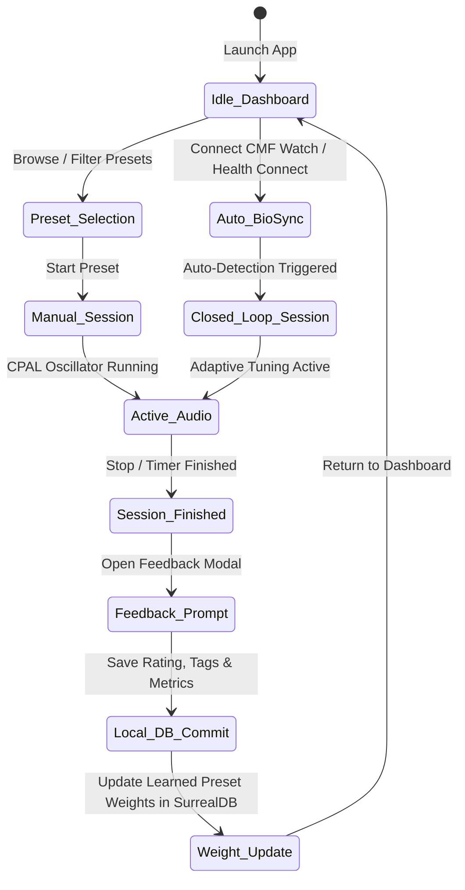

# NeuroLoop - Application Flow & State Transition Specification

## 1. Top-Level User Flow



---

## 2. Real-Time Closed-Loop Autonomous Flow

```text
[Wearable Data Input (CMF Watch Pro 2)]
                |
                v
[Health Connect / BLE Bridge]
                |
                v
[Noise Filter & Outlier Removal] (Median filter, movement threshold)
                |
                v
[Autonomic State Inference Engine]
  - Calculates ΔHR = HR_current - HR_baseline
  - Calculates HRV_RMSSD coherence
                |
                +---------------------------------------+
                |                                       |
     State = Sleep Onset                    State = High Stress
                |                                       |
                v                                       v
    Glide: Alpha (10Hz) -> Theta (6Hz)     Glide: Instant Rescue to Alpha (8.5Hz)
    Carrier: 108 Hz (A432)                 Carrier: 208/216 Hz (A432)
    Volume: Auto-fade down                 Soft-limiting volume
                |                                       |
                +-------------------+-------------------+
                                    |
                                    v
                        [Procedural Audio Output]
```

---

## 3. Post-Session Telemetry & Efficacy Update Flow
1. **Trigger**: Audio stops (manual tap, timer expiration, or deep sleep detection).
2. **Telemetry Finalization**: Rust queries rolling metrics from the current session buffer.
3. **Modal Display**: [`FeedbackDialog.tsx`](file:///home/jrad/RustroverProjects/NeuroLoop/src/components/FeedbackDialog.tsx) prompts user for $1-5\star$ rating, helpfulness boolean, and discomfort flags.
4. **SurrealDB Storage**:
   - `audio_sessions` record closed with duration and end reason.
   - `user_feedback` record saved.
   - `effectiveness_scores` computed and written.
5. **Adaptive Profile Update**: Active preset weight in `tuning_profiles` updated for that specific state context.
